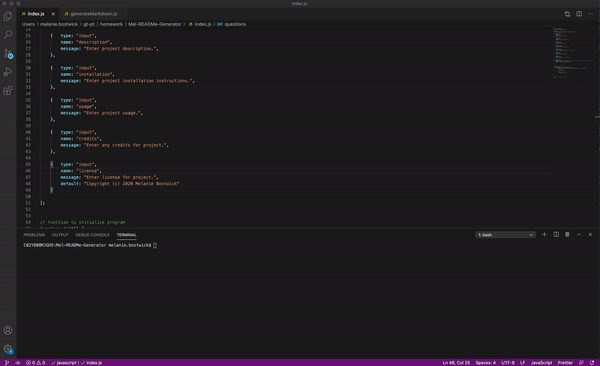

# Mel-READMe-Generator

## Table of Contents

* [Objective](#Objective)
* [Description](#Description)
* [Installation](#Installation)
* [Usage](#usage)
* [Credits](#credits)

 ## Objective
 
 - Create a README generator for projects that contains all markdowns and content.
 
 ## Description
 
 [GitHub](https://github.com/mbostwick1/Mel-READMe-Generator)
  
 - This README generator makes it much easier and more efficient to create the .md file once completing a project.
 
  ## Installation

- Use node index.js in terminal and follow prompted questions to generate README.md.

 ## Usage

## Credits
N/A

